# DAG reconstruction from log: node 5910978805891162

Source log excerpt indicates a B-tree leaf split where the leaf node **5910978805891162** is created and linked into the leaf-level sibling chain.

## Entities (nodes)

We reconstruct a dependency/relationship graph over **B-tree nodes (pages)** mentioned in the excerpt.

| Label                | Type                                  | Evidence in log                                                                |
|----------------------|---------------------------------------|--------------------------------------------------------------------------------|
| `I:4785078899048556` | Interior node (level=1)               | `node=id=4785078899048556 level=1 ... INTERIOR`                                |
| `L:4503603922337886` | Leaf node (level=0)                   | `node=[id=4503603922337886 next=5910978805891162 LEAF ...]`                    |
| `L:5910978805891162` | Leaf node (level=0)                   | `node=[id=5910978805891162 next=7318353689444442 LEAF ...]`                    |
| `L:7318353689444442` | Leaf node (level=0) (right sibling)   | referenced by `next=7318353689444442` and `Entry50 ... Val=7318353689444442.1` |
| `C:6755403736023146` | Child pointer value (pre-split child) | `Split child_node=6755403736023146 with new_child_node=4503603922337906`       |
| `C:4503603922337906` | Child pointer value (new child)       | `new_child_node=4503603922337906`                                              |
| `P:6755403736023126` | Parent (as reported in summary lines) | `parent=[6755403736023126]`                                                    |

Note: `C:*` values appear as “child_node/new_child_node” in the split debug line. In this excerpt we do not see full node descriptors (`level=...`) for them, so we keep them as referenced IDs.

## Edges (relationships)

We include only relationships that can be justified from the excerpt.

### Leaf sibling chain edges (`next` pointers)

- `L:4503603922337886  ──next──▶  L:5910978805891162`
  - Evidence: `node=[id=4503603922337886 next=5910978805891162 LEAF ...]`

- `L:5910978805891162  ──next──▶  L:7318353689444442`
  - Evidence: `node=[id=5910978805891162 next=7318353689444442 LEAF ...]`

So the leaf chain fragment is:

```
4503603922337886  →  5910978805891162  →  7318353689444442
```

### Parent → child edges (inferred from interior node entries)

The interior node print shows entries like:

- `Entry49 ... Val=4503603922337886.1`
- `Entry50 ... Val=5910978805891162.1`

This indicates the interior node `I:4785078899048556` has child pointers to both leaves.

- `I:4785078899048556  ──child──▶  L:4503603922337886`
- `I:4785078899048556  ──child──▶  L:5910978805891162`

Evidence: the `Val=` fields listed above.

(We do **not** add `I -> 731835...` here because in the shown excerpt we don’t see an entry with `Val=731835...` in the second print; it appears in the first print as `Entry50 ... Val=7318353689444442.1`, but that is before the split debug line and may reflect a different state. If you want, we can produce a “before/after” DAG pair.)

### Split event edges (event-level dependencies)

The split debug line:

`Split child_node=6755403736023146 with new_child_node=4503603922337906, split_key=...`

captures a relationship between the pre-split child and the newly created child. We represent this as a conceptual split edge:

- `C:6755403736023146  ──split_creates──▶  C:4503603922337906`

Additionally, the summary lines:

- `in_place_child=[4503603922337886], new_ids=[[5910978805891162]]`
- `in_place_child=[5910978805891162], new_ids=[[7318353689444442]]`

show the creation chain at leaf level:

- `L:4503603922337886  ──split_creates──▶  L:5910978805891162`
- `L:5910978805891162  ──split_creates──▶  L:7318353689444442`

These align with the observed `next` pointers.

## The reconstructed DAG (Graphviz DOT)

You can paste this into any DOT renderer.

```dot
digraph btree_split_dag {
  rankdir=LR;
  node [shape=box, fontname="Menlo"];

  // Nodes
  I4785078899048556 [label="INTERIOR 4785078899048556\nlevel=1\n(nEntries ~92)"];
  L4503603922337886 [label="LEAF 4503603922337886\nnext=5910978805891162"];
  L5910978805891162 [label="LEAF 5910978805891162\nnext=7318353689444442"];
  L7318353689444442 [label="LEAF 7318353689444442"];

  // Parent->child edges (from interior Val=...)
  I4785078899048556 -> L4503603922337886 [label="child (Entry49 Val)"];
  I4785078899048556 -> L5910978805891162 [label="child (Entry50 Val)"];

  // Leaf sibling chain
  L4503603922337886 -> L5910978805891162 [label="next"];
  L5910978805891162 -> L7318353689444442 [label="next"];

  // Split event edges (conceptual)
  L4503603922337886 -> L5910978805891162 [style=dashed, label="split created"];
  L5910978805891162 -> L7318353689444442 [style=dashed, label="split created"];
}
```



## Notes / assumptions

1. This is reconstructed from a *partial* log excerpt. If you provide the preceding/following “create DAG …” dump (often it prints edges), we can make this exact (including all parent/child links and any flush-order dependency edges).
2. Two prints of the same interior node show `nEntries=91` then `nEntries=92` and different key/value placements; the graph above models the stable relationships we can prove around node **5910978805891162**.
3. “DAG” in this context might be a *writeback dependency DAG* (flush order), not only structural pointers. The excerpt shows flushes of `450360...` and `591097...` but does not show explicit dependency edges between flush tasks, so we didn’t add ordering edges beyond structure.
